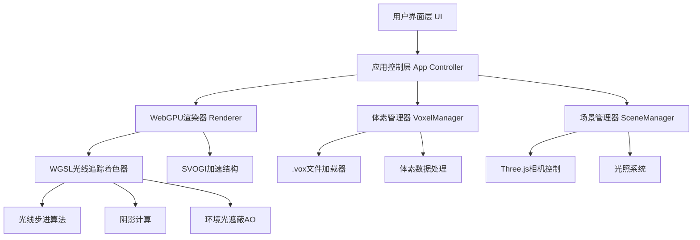
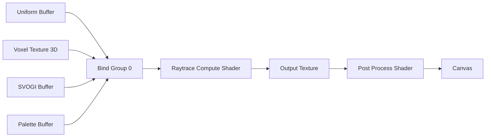
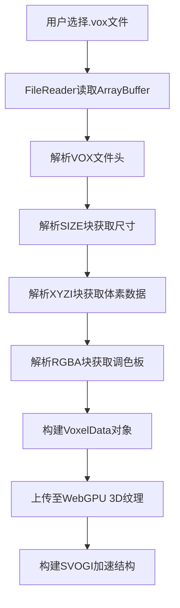
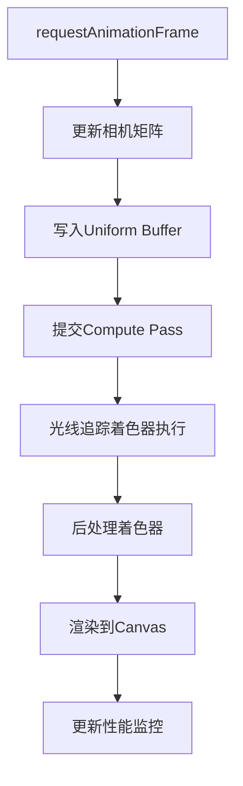

# WebGPU体素光线追踪渲染器 - 技术架构文档

## 1. 技术选型

| 技术栈 | 选择 | 理由 |
|--------|------|------|
| 构建工具 | Vite 5.x | 快速冷启动，原生ESM支持，适合WebGPU开发 |
| 语言 | TypeScript 5.x | 类型安全，大型项目可维护性 |
| 3D辅助 | Three.js r160+ | 成熟的3D数学库，用于相机控制和场景管理 |
| UI框架 | 原生Web Components | 轻量级，避免框架开销 |
| 样式 | TailwindCSS 4.x | 快速UI开发，原子化CSS |
| 着色语言 | WGSL | WebGPU原生着色语言，性能最优 |

## 2. 系统架构

### 2.1 整体架构图



### 2.2 目录结构

```
src/
├── core/
│   ├── WebGPURenderer.ts      # WebGPU渲染器核心
│   ├── VoxelManager.ts        # 体素数据管理
│   ├── SVOGIBuilder.ts        # 八叉树构建
│   └── SceneManager.ts        # 场景管理
├── loaders/
│   └── VoxLoader.ts           # .vox文件解析器
├── shaders/
│   ├── raytrace.wgsl          # 光线追踪主着色器
│   └── postprocess.wgsl       # 后处理着色器
├── ui/
│   ├── ControlPanel.ts        # 参数控制面板
│   └── PerformanceMonitor.ts  # 性能监控
├── utils/
│   ├── math.ts                # 数学工具
│   └── hdrexporter.ts         # HDR导出工具
├── types/
│   └── index.ts               # 类型定义
├── App.ts                     # 主应用入口
└── main.ts                    # 启动文件
```

## 3. 核心技术实现

### 3.1 WebGPU渲染管线



### 3.2 体素数据结构

```typescript
interface VoxelData {
  size: { x: number; y: number; z: number };
  voxels: Uint8Array;           // 体素索引 (0 = 空)
  palette: Float32Array;        // RGBA颜色调色板 (256 * 4)
  paletteCount: number;
}
```

### 3.3 SVOGI八叉树结构

```typescript
interface SVONode {
  children: number;             // 子节点偏移 (0 = 叶子节点)
  mask: number;                 // 8位子节点存在掩码
  color: number;                // 平均颜色索引
}
```

### 3.4 光线追踪着色器核心流程

1. **相机射线生成**：根据像素坐标生成世界空间射线
2. **光线步进**：使用DDA算法遍历体素网格
3. **相交测试**：检测射线与体素的交点
4. **着色计算**：
   - 漫反射：基于法线和光源方向
   - 阴影：发射阴影射线检测遮挡
   - AO：采样周围体素计算环境光遮蔽
5. **光线反弹**：递归追踪漫反射光线

### 3.5 性能优化策略

| 优化技术 | 实现方式 | 预期提升 |
|---------|---------|---------|
| SVOGI八叉树 | 空间层次结构加速 | 3-5x 渲染速度 |
| 空空间跳过 | DDA算法快速跳过空白区域 | 2-3x 渲染速度 |
| 早期终止 | 能量低于阈值停止追踪 | 1.5x 渲染速度 |
| 共享内存 | Compute Shader使用workgroup共享内存 | 1.2x 渲染速度 |
| 分块渲染 | 将屏幕分成多个tile并行处理 | 负载均衡 |

## 4. 数据流程

### 4.1 .vox文件加载流程



### 4.2 渲染帧流程



## 5. 关键接口定义

### 5.1 WebGPURenderer 接口

```typescript
interface IWebGPURenderer {
  init(canvas: HTMLCanvasElement): Promise<void>;
  setVoxelData(data: VoxelData): void;
  setRenderParams(params: RenderParams): void;
  render(): void;
  resize(width: number, height: number): void;
  exportHDR(width: number, height: number): Promise<ArrayBuffer>;
}
```

### 5.2 渲染参数

```typescript
interface RenderParams {
  maxBounces: number;           // 最大漫反射反弹次数
  shadowSteps: number;          // 阴影光线最大步数
  aoStrength: number;           // AO强度 0-1
  aoRadius: number;             // AO采样半径
  exposure: number;             // 曝光值
  resolutionScale: number;      // 渲染分辨率比例
  sunDirection: Vector3;        // 太阳方向
  sunColor: Vector3;            // 太阳颜色
  sunIntensity: number;         // 太阳强度
  ambientColor: Vector3;        // 环境光颜色
}
```

### 5.3 相机参数

```typescript
interface CameraParams {
  position: Vector3;
  target: Vector3;
  fov: number;                  // 视场角
  aspect: number;               // 宽高比
}
```

## 6. 性能预算

| 组件 | 时间预算 (ms) | 说明 |
|------|--------------|------|
| 光线追踪Compute Shader | ~12 | 1080p @ 60fps |
| 后处理 | ~1 | Tone mapping + Gamma校正 |
| 相机更新 | <0.1 | Three.js矩阵计算 |
| UI更新 | <0.5 | 参数面板刷新 |
| 总帧时间 | <16.6 | 60fps目标 |

## 7. 风险与挑战

### 7.1 技术风险
- **WebGPU兼容性**：部分浏览器版本可能不支持 → 提供清晰的浏览器检测和提示
- **性能目标**：256³体素实时光追难度高 → 分层LOD和质量档位设置
- **内存占用**：256³体素需要16MB显存 + SVOGI额外内存 → 提供内存使用监控

### 7.2 应对策略
- 实现多种质量档位（低/中/高/极致），用户可根据设备性能选择
- 提供渐进式渲染，先渲染低分辨率再逐步提升
- 内存超限自动降级体素分辨率
