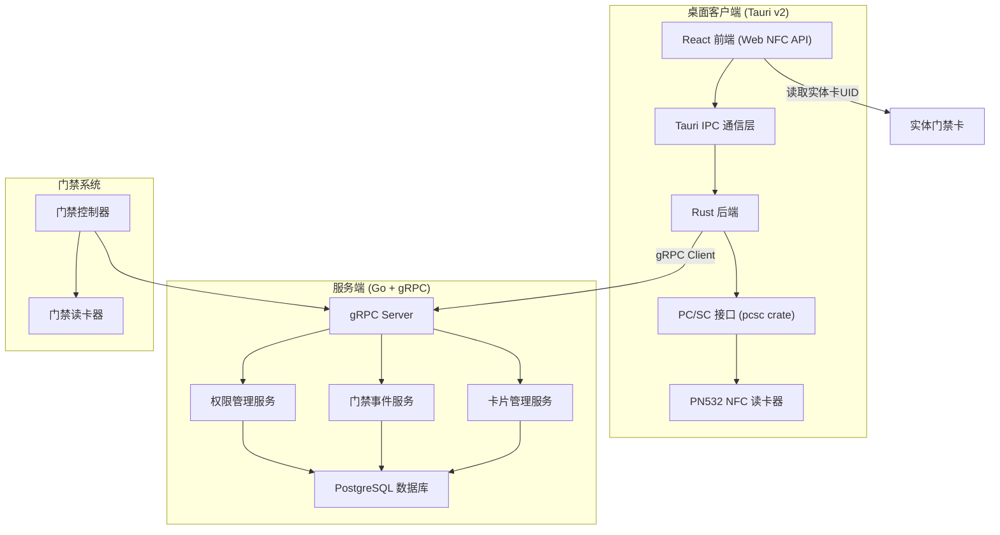
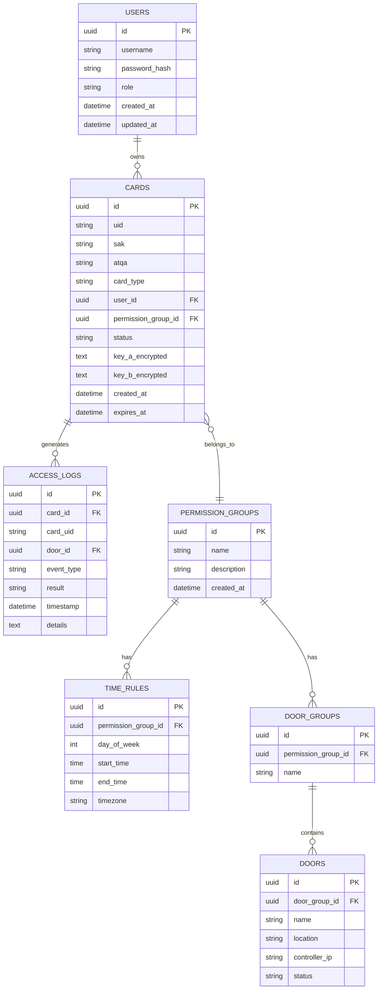

# NFC门禁卡模拟桌面应用 - 技术架构文档

## 1. 架构设计



## 2. 技术栈说明

### 2.1 桌面客户端
- **前端框架**: React 18 + TypeScript
- **构建工具**: Vite 5
- **样式方案**: TailwindCSS 3
- **UI组件**: Headless UI + Lucide React
- **NFC能力**: Web NFC API (Chrome/Edge支持)
- **桌面框架**: Tauri v2
- **Rust依赖**:
  - `tauri` v2.0 - 桌面应用框架
  - `pcsc` v2.8 - PC/SC智能卡接口
  - `prost` + `tonic` - gRPC客户端
  - `tokio` - 异步运行时
  - `serde` - 序列化/反序列化
  - `hex` - 十六进制编解码

### 2.2 服务端
- **语言**: Go 1.21+
- **RPC框架**: gRPC + Protocol Buffers
- **数据库**: PostgreSQL 15+
- **ORM**: GORM
- **认证**: JWT + mTLS
- **日志**: Zap

### 2.3 数据库设计



## 3. 目录结构

```
├── desktop/                    # Tauri桌面客户端
│   ├── src/                    # React前端
│   │   ├── components/         # 公共组件
│   │   ├── pages/              # 页面组件
│   │   ├── hooks/              # 自定义Hooks
│   │   ├── services/           # API服务
│   │   ├── store/              # 状态管理
│   │   ├── types/              # TypeScript类型
│   │   └── utils/              # 工具函数
│   ├── src-tauri/              # Rust后端
│   │   ├── src/
│   │   │   ├── commands/       # Tauri命令
│   │   │   ├── nfc/            # NFC/PCSC模块
│   │   │   ├── grpc/           # gRPC客户端
│   │   │   ├── models/         # 数据模型
│   │   │   └── main.rs
│   │   └── Cargo.toml
│   └── package.json
├── server/                     # Go服务端
│   ├── api/                    # gRPC API定义
│   │   └── access.proto
│   ├── cmd/                    # 应用入口
│   │   └── server/
│   ├── internal/               # 内部包
│   │   ├── service/            # 业务逻辑
│   │   ├── repository/         # 数据访问
│   │   ├── model/              # 数据模型
│   │   └── auth/               # 认证模块
│   ├── migrations/             # 数据库迁移
│   └── go.mod
└── proto/                      # 共享Protocol Buffers定义
    └── access.proto
```

## 4. Protocol Buffers 定义

```protobuf
syntax = "proto3";

package access.v1;

option go_package = "github.com/nfc-access/server/api/v1;accessv1";

// 卡片服务
service CardService {
  rpc RegisterCard(RegisterCardRequest) returns (RegisterCardResponse);
  rpc UnregisterCard(UnregisterCardRequest) returns (UnregisterCardResponse);
  rpc GetCard(GetCardRequest) returns (GetCardResponse);
  rpc ListCards(ListCardsRequest) returns (ListCardsResponse);
}

// 权限验证服务
service AccessService {
  rpc VerifyAccess(VerifyAccessRequest) returns (VerifyAccessResponse);
  rpc RemoteOpenDoor(RemoteOpenDoorRequest) returns (RemoteOpenDoorResponse);
}

// 事件日志服务
service AuditService {
  rpc GetAccessLogs(GetAccessLogsRequest) returns (GetAccessLogsResponse);
  rpc StreamAccessLogs(StreamAccessLogsRequest) returns (stream AccessLog);
}

message Card {
  string id = 1;
  string uid = 2;
  string card_type = 3;
  string user_id = 4;
  string permission_group_id = 5;
  string status = 6;
  int64 created_at = 7;
  int64 expires_at = 8;
}

message RegisterCardRequest {
  string uid = 1;
  string sak = 2;
  string atqa = 3;
  string card_type = 4;
  string user_id = 5;
  string permission_group_id = 6;
  bytes key_a = 7;
  bytes key_b = 8;
}

message VerifyAccessRequest {
  string card_uid = 1;
  string door_id = 2;
  int64 timestamp = 3;
}

message VerifyAccessResponse {
  bool allowed = 1;
  string reason = 2;
  string access_log_id = 3;
}

message AccessLog {
  string id = 1;
  string card_uid = 2;
  string door_id = 3;
  string event_type = 4;
  string result = 5;
  int64 timestamp = 6;
  string details = 7;
}
```

## 5. Rust NFC模块设计

### 5.1 PC/SC接口封装

```rust
// src-tauri/src/nfc/pcsc.rs
use pcsc::{Context, Scope, Card, ShareMode, Protocol};
use hex::ToHex;

pub struct NfcReader {
    context: Context,
    current_reader: Option<String>,
}

impl NfcReader {
    pub fn new() -> Result<Self, Box<dyn std::error::Error>> {
        let context = Context::establish(Scope::User)?;
        Ok(Self {
            context,
            current_reader: None,
        })
    }

    pub fn list_readers(&self) -> Result<Vec<String>, Box<dyn std::error::Error>> {
        let readers = self.context.list_readers()?;
        Ok(readers.map(|r| r.to_string_lossy().to_string()).collect())
    }

    pub fn connect(&mut self, reader_name: &str) -> Result<(), Box<dyn std::error::Error>> {
        self.current_reader = Some(reader_name.to_string());
        Ok(())
    }

    pub fn mifare_authenticate(
        &self,
        block: u8,
        key_type: u8,
        key: &[u8; 6],
        uid: &[u8],
    ) -> Result<bool, Box<dyn std::error::Error>> {
        // Mifare Classic认证逻辑
        // 0x60 = Key A, 0x61 = Key B
        let auth_cmd = build_mifare_auth_cmd(block, key_type, key, uid);
        let response = self.transmit(&auth_cmd)?;
        Ok(response.starts_with(&[0x90, 0x00]))
    }

    pub fn read_block(&self, block: u8) -> Result<Vec<u8>, Box<dyn std::error::Error>> {
        let read_cmd = [0xFF, 0xB0, 0x00, block, 0x10];
        self.transmit(&read_cmd)
    }

    pub fn write_block(&self, block: u8, data: &[u8; 16]) -> Result<(), Box<dyn std::error::Error>> {
        let mut write_cmd = vec![0xFF, 0xD6, 0x00, block, 0x10];
        write_cmd.extend_from_slice(data);
        let response = self.transmit(&write_cmd)?;
        if response.starts_with(&[0x90, 0x00]) {
            Ok(())
        } else {
            Err("Write failed".into())
        }
    }

    fn transmit(&self, command: &[u8]) -> Result<Vec<u8>, Box<dyn std::error::Error>> {
        let reader_name = self.current_reader.as_ref().ok_or("No reader connected")?;
        let card = self.context.connect(reader_name, ShareMode::Shared, Protocol::ANY)?;
        let mut recv_buffer = [0u8; 256];
        let response = card.transmit(command, &mut recv_buffer)?;
        Ok(response.to_vec())
    }
}

fn build_mifare_auth_cmd(
    block: u8,
    key_type: u8,
    key: &[u8; 6],
    uid: &[u8],
) -> Vec<u8> {
    let mut cmd = Vec::new();
    cmd.push(0xFF);
    cmd.push(0x86);
    cmd.push(0x00);
    cmd.push(0x00);
    cmd.push(0x05);
    cmd.push(0x01);
    cmd.push(0x00);
    cmd.push(block);
    cmd.push(key_type);
    cmd.push(0x04);
    cmd
}
```

### 5.2 Tauri命令定义

```rust
// src-tauri/src/commands/mod.rs
use tauri::command;
use crate::nfc::NfcReader;
use crate::grpc::AccessClient;

#[command]
pub async fn list_nfc_readers() -> Result<Vec<String>, String> {
    let reader = NfcReader::new().map_err(|e| e.to_string())?;
    reader.list_readers().map_err(|e| e.to_string())
}

#[command]
pub async fn connect_nfc_reader(reader_name: String) -> Result<(), String> {
    // 连接读卡器逻辑
    Ok(())
}

#[command]
pub async fn authenticate_mifare(
    block: u8,
    key_type: String,
    key: String,
    uid: String,
) -> Result<bool, String> {
    let key_bytes = hex::decode(&key).map_err(|e| e.to_string())?;
    let uid_bytes = hex::decode(&uid).map_err(|e| e.to_string())?;
    // 认证逻辑
    Ok(true)
}

#[command]
pub async fn register_card(
    uid: String,
    user_id: String,
    permission_group_id: String,
    key_a: String,
    key_b: String,
) -> Result<String, String> {
    // 注册卡片到服务端
    let client = AccessClient::new().await.map_err(|e| e.to_string())?;
    let card_id = client.register_card(uid, user_id, permission_group_id, key_a, key_b)
        .await.map_err(|e| e.to_string())?;
    Ok(card_id)
}
```

## 6. 关键技术点

### 6.1 Mifare Classic 1K 密钥管理
- 密钥A和密钥B使用AES-256-GCM加密存储
- 加密密钥存储在操作系统密钥链中（Windows Credential Manager / macOS Keychain / Linux Secret Service）
- 内存中的密钥使用零化处理

### 6.2 Web NFC 读取
```typescript
// src/utils/nfc.ts
export const readNfcCard = async (): Promise<{ uid: string; sak: string; atqa: string }> => {
  if (!('NDEFReader' in window)) {
    throw new Error('Web NFC is not supported in this browser');
  }
  
  const ndef = new (window as any).NDEFReader();
  await ndef.scan();
  
  return new Promise((resolve, reject) => {
    const timeout = setTimeout(() => reject(new Error('NFC reading timeout')), 30000);
    
    ndef.onreading = (event: any) => {
      clearTimeout(timeout);
      const uid = Array.from(event.serialNumber)
        .map((b: number) => b.toString(16).padStart(2, '0'))
        .join(':')
        .toUpperCase();
      resolve({ uid, sak: event.sak || '', atqa: event.atqa || '' });
    };
    
    ndef.onreadingerror = () => {
      clearTimeout(timeout);
      reject(new Error('Failed to read NFC card'));
    };
  });
};
```

### 6.3 时间段权限验证
```go
// server/internal/service/access.go
func (s *AccessService) VerifyAccess(ctx context.Context, req *VerifyAccessRequest) (*VerifyAccessResponse, error) {
    card, err := s.cardRepo.GetByUID(ctx, req.CardUid)
    if err != nil {
        return &VerifyAccessResponse{Allowed: false, Reason: "Card not found"}, nil
    }
    
    if card.Status != "active" {
        return &VerifyAccessResponse{Allowed: false, Reason: "Card is inactive"}, nil
    }
    
    now := time.Now()
    if card.ExpiresAt != nil && now.After(*card.ExpiresAt) {
        return &VerifyAccessResponse{Allowed: false, Reason: "Card has expired"}, nil
    }
    
    allowed, err := s.checkTimeRules(ctx, card.PermissionGroupID, now)
    if err != nil || !allowed {
        return &VerifyAccessResponse{Allowed: false, Reason: "Access denied by time rules"}, nil
    }
    
    return &VerifyAccessResponse{Allowed: true}, nil
}

func (s *AccessService) checkTimeRules(ctx context.Context, groupID uuid.UUID, t time.Time) (bool, error) {
    rules, err := s.timeRuleRepo.ListByGroupID(ctx, groupID)
    if err != nil {
        return false, err
    }
    
    if len(rules) == 0 {
        return true, nil
    }
    
    weekday := int(t.Weekday())
    currentTime := t.Format("15:04:05")
    
    for _, rule := range rules {
        if rule.DayOfWeek == weekday || rule.DayOfWeek == -1 {
            if currentTime >= rule.StartTime && currentTime <= rule.EndTime {
                return true, nil
            }
        }
    }
    
    return false, nil
}
```

## 7. 安全设计

1. **mTLS双向认证**：桌面客户端与服务端通信使用双向TLS认证
2. **密钥加密存储**：Mifare密钥使用操作系统级密钥管理
3. **敏感数据脱敏**：日志中UID等敏感信息进行脱敏处理
4. **操作审计**：所有管理操作记录详细审计日志
5. **JWT令牌**：用户认证使用短期JWT令牌，支持吊销
