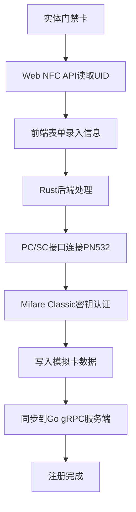

# NFC门禁卡模拟桌面应用 - 产品需求文档

## 1. 产品概述

本项目是一个跨平台（Windows/macOS/Linux）的NFC门禁卡模拟桌面应用，使用Tauri v2 + React + Rust技术栈构建。应用通过Web NFC API读取实体门禁卡UID，后端Rust通过PC/SC接口写入PN532读卡器，配合Go + gRPC服务端进行权限管理。

- **核心价值**：实现门禁卡的数字化管理，支持权限精细化控制，提供完整的审计追踪能力
- **目标用户**：企业IT管理员、物业管理人员、安全运维人员
- **目标场景**：办公楼宇门禁管理、实验室门禁管控、园区出入管理

## 2. 核心功能

### 2.1 用户角色

| 角色 | 注册方式 | 核心权限 |
|------|----------|----------|
| 超级管理员 | 系统初始化 | 用户管理、卡片管理、权限配置、系统设置、日志审计 |
| 普通管理员 | 超级管理员创建 | 卡片注册/注销、权限分配、日志查看 |
| 普通用户 | 管理员创建 | 查看个人卡片信息、开门记录、申请临时权限 |

### 2.2 功能模块

1. **卡片管理**：卡片注册、卡片注销、卡片信息查询、Mifare Classic 1K密钥认证
2. **权限管理**：时间段权限配置、门禁分组管理、用户权限分配
3. **日志审计**：门禁事件记录、操作日志查询、异常告警
4. **远程控制**：远程开门API、批量权限更新
5. **系统设置**：读卡器配置、服务端连接配置、密钥管理

### 2.3 页面详情

| 页面名称 | 模块名称 | 功能描述 |
|---------|----------|----------|
| 登录页 | 身份认证 | 用户名密码登录、服务端地址配置 |
| 仪表盘 | 概览统计 | 今日开门次数、在线读卡器状态、最近事件列表 |
| 卡片管理 | 卡片列表 | 卡片CRUD、批量导入导出、密钥状态显示 |
| 卡片管理 | 卡片注册 | Web NFC读卡、手动输入UID、密钥认证、写入PN532 |
| 权限管理 | 时间段配置 | 工作日/周末/节假日配置、时间段规则创建 |
| 权限管理 | 门禁分组 | 读卡器分组管理、权限批量分配 |
| 日志审计 | 事件日志 | 开门记录查询、筛选导出、异常事件高亮 |
| 远程控制 | 远程开门 | 选择读卡器、一键开门、操作记录 |
| 系统设置 | 读卡器配置 | PN532设备连接检测、PC/SC接口状态 |
| 系统设置 | 服务端配置 | gRPC服务地址、TLS证书配置、连接测试 |

## 3. 核心流程

### 3.1 卡片注册流程

用户将实体门禁卡贴近支持Web NFC的设备读卡器 → 前端通过Web NFC API读取卡片UID → 输入卡片备注信息和使用人 → 选择权限组 → 后端Rust通过PC/SC接口连接PN532读卡器 → 进行Mifare Classic 1K密钥认证 → 将卡片数据写入PN532模拟卡 → 注册信息同步到Go服务端 → 完成注册

### 3.2 门禁验证流程

用户使用PN532模拟卡贴近门禁读卡器 → 门禁读卡器读取模拟卡UID → 门禁控制器调用gRPC服务验证权限 → 服务端检查卡片状态和时间段权限 → 返回验证结果 → 门禁控制器执行开门/拒绝操作 → 记录门禁事件日志

## 4. 用户界面设计

### 4.1 设计风格

- **设计理念**：专业安全、简洁高效的企业级管理系统风格
- **主色调**：深蓝色系 (#1e3a5f) 代表专业和安全
- **辅助色**：绿色 (#10b981) 表示成功/允许，红色 (#ef4444) 表示警告/拒绝，橙色 (#f59e0b) 表示待处理
- **字体**：使用 JetBrains Mono 作为代码显示字体，Inter 作为界面字体
- **布局**：侧边导航 + 顶部工具栏 + 主内容区的经典管理后台布局
- **按钮风格**：圆角矩形，带有微妙的悬停动效，主按钮使用渐变背景
- **图标风格**：使用 Lucide React 图标库，线条简洁一致

### 4.2 页面设计概述

| 页面名称 | 模块名称 | UI元素 |
|---------|----------|--------|
| 登录页 | 身份认证 | 居中卡片布局、玻璃拟态背景、表单动画、连接状态指示器 |
| 仪表盘 | 概览统计 | 数据卡片网格、实时状态指示灯、事件时间线、读卡器状态分布图 |
| 卡片管理 | 卡片列表 | 数据表格、筛选工具栏、批量操作、密钥状态徽章 |
| 卡片管理 | 卡片注册 | NFC读卡动画、进度指示器、密钥认证状态、成功/失败反馈 |
| 日志审计 | 事件日志 | 时间轴布局、事件类型色标、搜索过滤面板、导出按钮 |
| 系统设置 | 读卡器配置 | 设备列表、连接状态、信号强度指示器、测试按钮 |

### 4.3 响应式

- 桌面端优先设计，支持1280px及以上分辨率
- 侧边栏可折叠，适配不同屏幕宽度
- 表格支持横向滚动，确保小屏幕下数据可读性
- 触摸设备优化按钮尺寸和交互区域

### 4.4 动效设计

- NFC读卡时的波纹扩散动画
- 数据加载时的骨架屏效果
- 状态变化时的平滑过渡
- 门禁事件实时推送的通知动效
