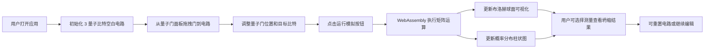

## 1. 产品概述

浏览器端量子电路模拟器，集成 WebAssembly 高性能矩阵运算与 Three.js 3D 可视化，为量子计算学习者和研究者提供直观、交互式的量子电路设计与仿真环境。

- 核心目标：在浏览器中实现高性能量子态向量模拟，支持最多 12 量子比特的电路仿真
- 目标用户：量子计算学习者、研究人员、教育工作者
- 核心价值：无需安装任何软件，通过浏览器即可进行量子电路设计、仿真和可视化分析

## 2. 核心功能

### 2.1 功能模块

1. **量子电路编辑器**：拖拽式电路图设计，支持量子门的添加、删除、移动和连接
2. **量子态模拟器**：基于 WebAssembly + C++ Eigen 的高性能态向量模拟器
3. **布洛赫球面可视化**：Three.js 3D 渲染单量子比特态在布洛赫球上的表示
4. **概率分布显示**：实时显示各量子态的测量概率分布柱状图
5. **算法示例库**：预置 Grover 搜索等经典量子算法示例

### 2.2 页面详情

| 页面名称 | 模块名称 | 功能描述 |
|----------|----------|----------|
| 主工作区 | 电路编辑器 | 拖拽量子门到电路线上，支持多量子比特线路编辑 |
| 主工作区 | 量子门面板 | 展示可用量子门（H, X, Y, Z, CNOT, T, S 等），可拖拽到电路 |
| 主工作区 | 布洛赫球面 | 3D 可视化展示选中量子比特的量子态 |
| 主工作区 | 概率分布图 | 柱状图显示所有可能测量结果的概率 |
| 主工作区 | 控制面板 | 运行模拟、重置电路、单步执行、添加量子比特 |
| 侧边栏 | 算法示例 | 快速加载预置的量子算法示例（如 Grover 搜索） |
| 侧边栏 | 电路信息 | 显示当前电路状态、量子比特数、门数量等信息 |

## 3. 核心流程

## 4. 用户界面设计

### 4.1 设计风格

- **主色调**：深空蓝 (#0a192f) 作为背景，量子蓝 (#64ffda) 作为主强调色，辅以紫色 (#bd93f9) 表示量子叠加态
- **辅助色**：绿色 (#50fa7b) 表示概率高的态，红色 (#ff5555) 表示操作警告
- **按钮风格**：玻璃拟态 (Glassmorphism)，半透明背景 + 模糊效果，悬停时有发光效果
- **字体**：JetBrains Mono 作为代码/数字字体，Inter 作为界面文本字体
- **布局风格**：三栏式布局（左侧控制面板 + 中间电路编辑区 + 右侧可视化区），深色科技感主题
- **图标**：使用 lucide-react 线性图标，保持简洁科技感

### 4.2 页面设计概述

| 页面名称 | 模块名称 | UI 元素 |
|----------|----------|----------|
| 主工作区 | 电路编辑器 | 网格背景、水平量子比特线、量子门节点、拖拽手柄、连接线 |
| 主工作区 | 量子门面板 | 分类标签（单比特门/多比特门）、门图标卡片、悬停预览 |
| 主工作区 | 布洛赫球面 | 3D 可旋转球体、坐标轴标记、量子态矢量、透明度控制 |
| 主工作区 | 概率分布图 | 水平柱状图、态标签（二进制）、概率百分比、颜色渐变 |
| 主工作区 | 控制面板 | 圆角按钮组、步进器（调整量子比特数）、状态指示器 |

### 4.3 响应性

- 桌面端优先设计（≥1440px）
- 中等屏幕（1024px-1440px）：调整面板宽度比例
- 平板及以下：采用垂直堆叠布局，可视化区域移至电路编辑器下方

### 4.4 3D 场景指引

- **环境**：深色空间背景，微弱星点粒子效果，营造量子计算的科技神秘感
- **光照**：半球光 + 两盏方向光，突出布洛赫球的金属质感和量子态矢量的发光效果
- **相机**：透视相机，初始距离 3 单位，支持轨道控制（OrbitControls）
- **交互**：鼠标拖拽旋转球体，滚轮缩放，双击重置视角
- **后处理**：Bloom 效果使量子态矢量和坐标轴产生辉光
- **性能**：单个布洛赫球面场景，低多边形球体（32 分段），确保流畅 60fps
