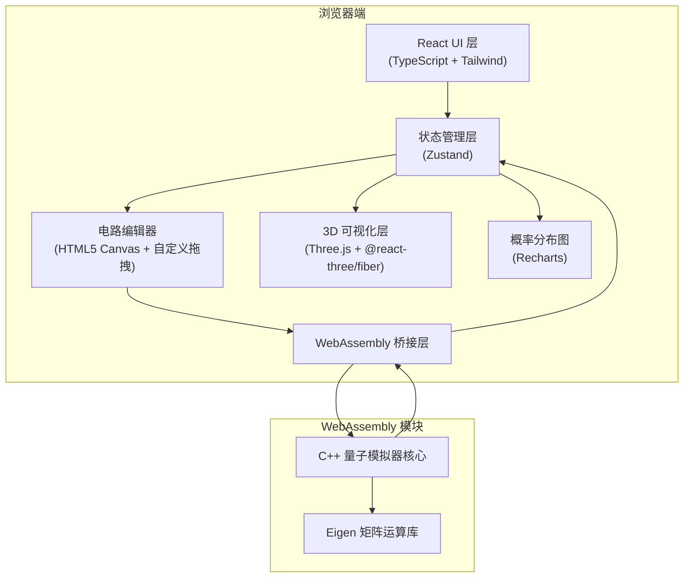

## 1. 架构设计



## 2. 技术描述

- **前端框架**：React@18 + TypeScript + Vite@5
- **样式方案**：TailwindCSS@3 + CSS 变量
- **状态管理**：Zustand
- **3D 可视化**：Three.js + @react-three/fiber + @react-three/drei + @react-three/postprocessing
- **图表**：Recharts
- **图标**：lucide-react
- **WebAssembly 工具链**：Emscripten
- **C++ 矩阵库**：Eigen@3.4
- **电路编辑器**：原生 HTML5 Canvas API 实现拖拽交互

## 3. 目录结构

```
e:\trae\39\
├── src\
│   ├── components\
│   │   ├── CircuitEditor\         # 电路编辑器组件
│   │   ├── GatePanel\             # 量子门选择面板
│   │   ├── BlochSphere\           # 布洛赫球面 3D 组件
│   │   ├── ProbabilityChart\      # 概率分布图组件
│   │   ├── ControlPanel\          # 控制面板
│   │   └── AlgorithmExamples\     # 算法示例面板
│   ├── store\                     # Zustand 状态管理
│   │   └── quantumStore.ts
│   ├── hooks\                     # 自定义 Hooks
│   │   ├── useQuantumSimulator.ts
│   │   └── useCircuitDrag.ts
│   ├── utils\                     # 工具函数
│   │   ├── quantumGates.ts        # 量子门定义
│   │   ├── wasmBridge.ts          # WebAssembly 桥接
│   │   └── blochCalculations.ts   # 布洛赫球计算
│   ├── types\                     # TypeScript 类型定义
│   │   └── quantum.ts
│   ├── App.tsx
│   ├── main.tsx
│   └── index.css
├── wasm\                          # C++ WebAssembly 源码
│   ├── CMakeLists.txt
│   ├── quantum_simulator.cpp      # 量子模拟器核心
│   ├── quantum_simulator.h
│   └── eigen\                     # Eigen 库（子模块或直接包含）
├── public\
│   └── quantum_simulator.wasm     # 编译后的 WASM 文件
├── package.json
├── tsconfig.json
├── vite.config.ts
├── tailwind.config.js
└── postcss.config.js
```

## 4. 核心数据模型

### 4.1 量子门类型
```typescript
type GateType = 'H' | 'X' | 'Y' | 'Z' | 'CNOT' | 'T' | 'S' | 'TDG' | 'SDG' | 'I';

interface QuantumGate {
  id: string;
  type: GateType;
  targetQubit: number;
  controlQubit?: number;  // 用于 CNOT 等受控门
  position: { x: number; y: number };  // 在编辑器中的位置
}
```

### 4.2 量子电路
```typescript
interface QuantumCircuit {
  qubitCount: number;
  gates: QuantumGate[];
  stateVector: Complex[];  // 2^qubitCount 个复数
  isSimulated: boolean;
}

interface Complex {
  real: number;
  imag: number;
}
```

### 4.3 测量结果
```typescript
interface MeasurementResult {
  state: string;  // 二进制字符串，如 '010'
  probability: number;
  amplitude: Complex;
}
```

## 5. WebAssembly API 设计

```typescript
// WASM 暴露的接口
interface QuantumSimulatorWASM {
  // 创建新的量子模拟器
  createSimulator(qubitCount: number): number;
  
  // 销毁模拟器
  destroySimulator(simulatorId: number): void;
  
  // 应用单量子比特门
  applySingleQubitGate(simulatorId: number, gateType: string, targetQubit: number): void;
  
  // 应用 CNOT 门
  applyCNOT(simulatorId: number, controlQubit: number, targetQubit: number): void;
  
  // 获取态向量（返回 Float32Array，每两个元素表示一个复数：实部、虚部）
  getStateVector(simulatorId: number): Float32Array;
  
  // 测量所有量子比特，返回测量结果的整数表示
  measureAll(simulatorId: number): number;
  
  // 重置态向量到 |000...0>
  resetState(simulatorId: number): void;
  
  // 计算 Grover 算法的 oracle
  applyGroverOracle(simulatorId: number, targetState: number): void;
  
  // 应用 Grover 扩散算子
  applyGroverDiffusion(simulatorId: number): void;
}
```

## 6. 性能优化策略

1. **WebAssembly 内存管理**：使用 Emscripten 的 HEAPF32 直接在 WASM 内存中存储态向量，避免频繁的 JS ↔ WASM 数据拷贝
2. **按需模拟**：仅在电路改变时重新计算，使用缓存避免重复计算相同电路
3. **12 量子比特限制**：2^12 = 4096 个复数，内存占用可控（每个复数 8 字节，约 32KB）
4. **增量更新可视化**：布洛赫球面和概率图仅在态向量改变时更新
5. **Canvas 渲染优化**：电路编辑器使用离屏 canvas 预渲染量子比特线和网格

## 7. 核心算法实现

### 7.1 Grover 搜索算法
- **步骤**：
  1. 初始化所有量子比特为 |0⟩ 态
  2. 对所有量子比特应用 Hadamard 门创建均匀叠加态
  3. 重复 π/4 * √N 次（N = 2^n）：
     - 应用 Oracle 标记目标态
     - 应用扩散算子放大幅值
  4. 测量得到目标态

### 7.2 态向量模拟
- 使用列主序存储复数数组
- 量子门操作使用张量积的高效实现
- 多量子比特门使用比特位置掩码进行高效索引计算
